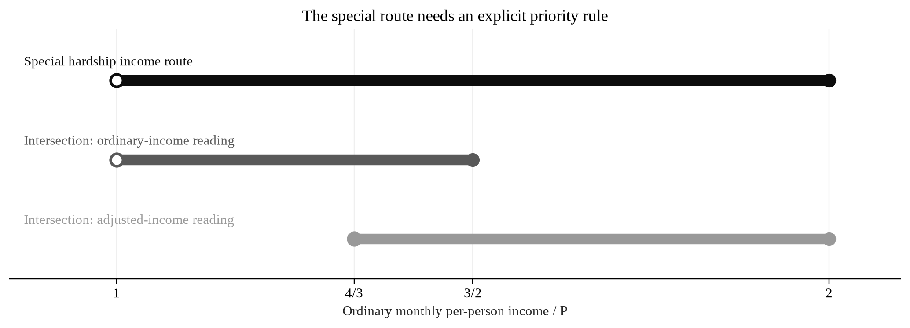
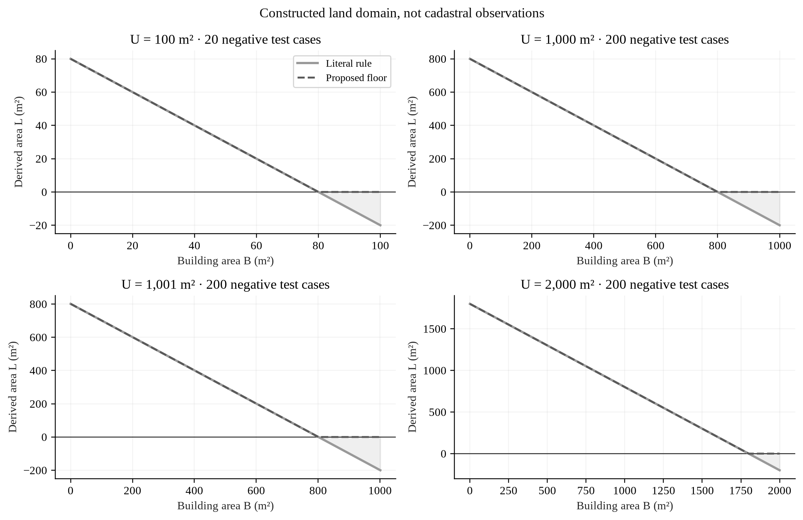
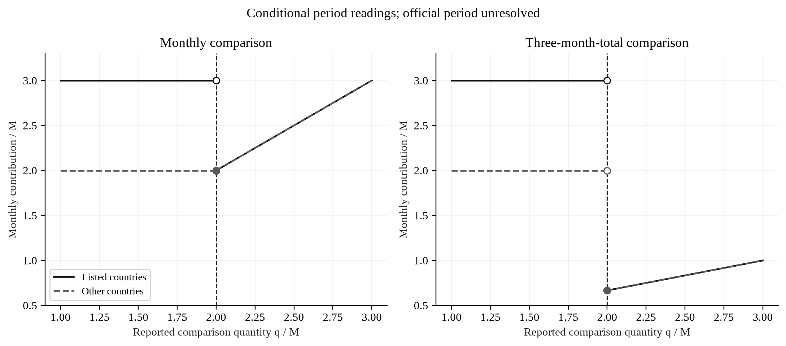

# Making Social Registry Classification Reproducible

Earlier Markdown working input, retained for traceability. Current submission wording is maintained in the corresponding LaTeX sources; this input is not regenerated into the submission.
## An exact audit of Uzbekistan’s published household-income rules and a normative verification framework for PF-193

**Earlier Markdown drafting input · 30 September 2026 · Asia/Tashkent.** The current maintained manuscript is [research_paper.tex](research_paper.tex); the complete Russian translation is [research_paper_ru.tex](research_paper_ru.tex). This earlier input is not the current submission text and is not used to regenerate the maintained LaTeX sources.

**Authorship of the current manuscript:** Abduxoliq Akmal ugli Ashuraliyev, independent research contribution. No academic qualification, institutional endorsement or statutory expert appointment is claimed. The maintained manuscript accompanies an author-proposed Uzbek legislative insertion module. It is neither an adopted act nor an official government conclusion.

## Purpose and completed findings

Uzbekistan’s Presidential Decree PF-193 mandates multidimensional household assessment from January 2027 and preparation of an implementing normative act. A useful scientific contribution requires a distinction between faithful computation of legal rules and empirical accuracy in identifying need. This study performs the former using current published provisions, exact rational arithmetic and explicitly constructed inputs. It reproduces the official income example without discrepancy, identifies an equality inconsistency between recognition and category predicates, and derives the intervals in which hardship-specific rules require explicit precedence over general category wording. Exhaustive enumeration of 4,105 constructed land configurations produces 620 negative derived areas under the literal formula; these counts characterize the test domain and do not estimate household prevalence. Conditional remittance calculations demonstrate that specifying the comparison period is necessary to determine both units and threshold discontinuities. Additional checks establish the tax-floor crossover, informal-income contribution, sex-specific coefficient difference and fractional livestock exemption. The study translates these findings into a proposed methodology passport, versioned decision records, prespecified verification, lawful Agency-side validation and independent calculation controls. The 2027 scoring weights and administrative observations were unavailable. Consequently, targeting accuracy, fiscal effects and the number of households affected remain unmeasured. The contribution is a reproducible legal-computational audit and a concrete drafting module capable of incorporation through Article 22 drafting participation.

**Keywords:** Social Registry; Uzbekistan; normative legal acts; exact arithmetic; household classification; administrative data; drafting controls.

## 1. Introduction and legal problem

Household classification has at least three distinct meanings: a calculation produces a score or income measure; a legally specified process assigns a registry category; and a particular programme determines entitlement and payment. Combining these stages into a single opaque output makes it difficult to identify whether a disputed result arose from source data, arithmetic, an exception, a category rule or a separate programme condition. A reproducible system must preserve those distinctions even where the same information system executes them.

The immediate legislative opportunity is specific. Paragraphs 13–14 of PF-193, dated 11 September 2026, introduce multidimensional assessment from 1 January 2027 and direct the National Agency for Social Protection and Ministry of Economy and Finance to submit the implementing draft to the Presidential Administration by 1 December 2026. Paragraph 14 does not identify the final instrument’s legal form. Accordingly, this paper proposes an insertion module and consequential amendments for the competent developer to integrate, rather than claim that a completed Cabinet resolution alone fulfils the mandate. [PF-193](https://lex.uz/docs/-8472526).

Existing law supplies an operational baseline. Cabinet Resolution 35 of 29 January 2026 establishes registry rules, income calculations, reassessment, information exchange and appeal arrangements. The consolidated text retrieved on the working date includes amendments made during 2026. PF-258 of 26 December 2025 supplies higher-ranking category provisions and hardship conditions. These instruments remain material to implementation unless the new act lawfully amends them. A new scoring model does not, by itself, repeal existing refusal grounds or grant a programmer authority to reconcile inconsistent legal text. [Resolution 35](https://lex.uz/docs/-8027513); [PF-258](https://lex.uz/docs/-7952180).

The research question is therefore deliberately falsifiable: **do the selected published rules produce reproducible, internally coherent income and category predicates across their stated boundaries and declared input domains?** A transcription error, an applicable omitted exception, a legally narrower domain or disagreement with independent arithmetic would defeat a corresponding finding. The question does not ask whether a newly fitted model predicts poverty well. No 2027 weights or Agency household records were supplied, so that second question cannot be answered here.

The proposed participation route is Article 22 of O‘RQ-682. It permits consenting citizens with relevant knowledge and experience to participate in drafting groups; participation is discretionary and qualification must be evidenced. Article 20 supports submission of proposals. Article 24 governs consultation and justification of rejected proposals. [O‘RQ-682](https://lex.uz/docs/-5378966).

## 2. Evidence reviewed and its limits

### 2.1. Retrieval and currency

This is a targeted narrative review of primary documents, not a systematic review. Official consolidated legislation, official statistics, publisher pages, author-hosted published research and World Bank reports were retrieved during the project. Relevant provisions, abstracts and selected full-text sections were inspected. Sources that could not be retrieved beyond a search snippet were excluded from the substantive synthesis. Direct retrieval was used because the research-lookup provider was not configured. Searches for later corrections and current official instruments were checks on currency; they do not prove that no correction, unpublished draft or unindexed amendment exists.

Legal texts are cited by instrument and provision. For large reports, printed pages are distinguished from PDF page numbers. The 2026 Uzbekistan assessment’s printed page 40 is PDF page 42; the delivery-systems sourcebook’s printed page 141 is PDF page 171. The source selection is sufficient to motivate the proposed verification architecture, but it cannot establish that this architecture is uniquely optimal. Foreign evidence is used to identify questions and mechanisms, not to import coefficients or expected Uzbek effects.

### 2.2. Contemporary Uzbekistan evidence

Official SIAT statistics report national poverty rates of 17.0, 14.1, 11.0, 8.9 and 5.8 percent for 2021–2025. These published aggregates provide context; they are not observations used to calibrate this audit or evidence that a particular registry algorithm caused the decline. Regional poverty rates cannot validate individual household classifications. [National Statistics Committee, SIAT series 3495](https://siat.stat.uz/data/3495/).

The World Bank’s Uzbekistan poverty and equity assessment, published on 18 September 2026, discusses coverage and targeting of low-income family assistance. Its printed page 40 notes that effectiveness evidence for the formula revised in early 2026 was not yet available. Its technical annex describes the income-based statistical welfare aggregate. That aggregate should not be treated as identical to the administrative measure, which includes legally imputed income and specific inclusions and exclusions. The report supports an empirical research need; it does not validate the unpublished 2027 score or demonstrate operational incidence of this paper’s counterexamples. [World Bank, 2026, pp. 40 and 78](https://documents1.worldbank.org/curated/en/099091826081016988/pdf/P507037-a67dabb6-2302-46a0-be08-a951d35f90c3.pdf).

### 2.3. What international evidence contributes

The 2025 World Bank review of social registries discusses dynamic updating, on-demand access, interoperability and administrative capacity. Its discussion supports treating a registry as part of a delivery process: database coverage and programme eligibility are different objects. It supplies no transferable Uzbek acceptance threshold. [World Bank, 2025, pp. 13–15](https://documents1.worldbank.org/curated/en/099071525165029379/pdf/P177331-a772f9c1-e340-4f76-aeb0-90fd4e7a3496.pdf).

The Indonesia data-quality assessment emphasizes common standards, freshness, audit and local implementation capacity. These considerations motivate a variable passport and explicit correction pathway here. The mechanism that could transfer is improved traceability of source values; the size of any benefit depends on Uzbek source systems and staffing, which were not observed. [Hadiwidjaja, Williams and Giannozzi, 2022, pp. 22–23](https://documents1.worldbank.org/curated/en/099515110132223290/pdf/P177341026be35061089cf0d835280eaf15.pdf).

The delivery-systems sourcebook separates assessment from eligibility, enrolment, notification and benefit provision. Its grievance discussion includes errors arising at different delivery stages. This distinction supports retaining calculation records and routing a correction to the responsible process rather than equating a score with payment. Historical country examples in the book are not presented as current institutional facts. [Lindert et al., 2020, pp. 141 and 332](https://documents1.worldbank.org/curated/en/519831596182628993/pdf/Sourcebook-on-the-Foundations-of-Social-Protection-Delivery-Systems.pdf).

The 2022 targeting synthesis places policy objectives, programme design, targeting choice and implementation in a hierarchy. It also cautions that the payoff from more complex models depends on data and context. That supports first specifying what “correct” means before optimizing a score. [Grosh et al., 2022, pp. 4 and 27](https://documents1.worldbank.org/curated/en/099300006162240907/pdf/P1648760df4c480270bd0b02288943f413e.pdf).

Two primary studies illustrate why welfare validation needs a declared comparator. Alatas and colleagues’ randomized Indonesian study compared proxy-means, community and hybrid targeting in 640 villages: ranking against consumption and participant satisfaction did not identify an identical preferred method. This is evidence from one setting, not an estimate for Uzbekistan. Aiken and colleagues’ Togo study found that performance of phone-data targeting depended on whether the comparison was geographical targeting or a hypothetical comprehensive registry. Neither study supports treating an old administrative decision as an unquestionable welfare label. [Alatas et al., 2012](https://economics.mit.edu/sites/default/files/publications/Targeting%20Paper%20AER%20--%20Final%20Published.pdf); [Aiken et al., 2022](https://www.nature.com/articles/s41586-022-04484-9).

Together these sources support a separation of **rule conformance**, **data quality**, **welfare validity** and **delivery outcomes**. The completed analysis establishes selected conformance properties. The other dimensions remain a proposed Agency research programme.

## 3. Materials and computational methods

### 3.1. Data objects and units

The inputs are published legal constants and constructed cases. The 2026 monthly minimum consumption expenditure per person is denoted P = 715,000 soum. Monthly minimum remuneration is M = 1,360,000 soum from 1 September 2026. The former is taken from the National Statistics Committee’s 4 March 2026 announcement; the latter from PF-115. M is used only for dated September single-month diagnostics. It is not substituted retrospectively into every month of a three-month income history. [Official P announcement](https://stat.uz/uz/matbuot-markazi/qo-mita-yangiliklar/67179-minimal-istemol-kharazhatlari-ijmati-t-risida-2); [PF-115](https://lex.uz/docs/-8283656).

Let Y be included household income over the selected three months and N be the legally relevant number of members. The monthly per-person measure is D = Y/(3N). This paper does not reconstruct the complete Y aggregation from administrative data. It audits selected contribution formulas and category predicates. Contributions described as monthly must be converted to period totals once, before division by three; a second division or omission of the period conversion changes the meaning of D.

The reference implementation is `scripts/run_analysis.py`. Numeric inputs are integers or rational/decimal strings and calculations use Python’s exact Fraction type. Floating-point inputs, invalid divisors, malformed values, duplicate fields and unsupported configuration fields are rejected. Exact arithmetic prevents an accidental binary approximation from deciding an equality test. Production rounding still requires an authoritative rule: this study does not invent a rounding convention and attribute it to the Agency.

### 3.2. Prespecification and selection

The original audit was specified in PLAN.md before execution, following exploratory reading of the provisions. Its candidates were therefore known in advance; it is a formal diagnostic, not a blinded confirmatory population study. The later extension retained the approved method and froze its cases before execution. A counterexample arising from the first independent review was explicitly labelled post-hoc and retained as a regression check.

The original income grid uses P, 1.5P and 2P with offsets of minus one, zero and plus one soum, plus a former-category control at P. The extension examines hardship values around P, 4P/3, 1.5P and 2P. It enumerates every integer building area B from zero through total plot area U for U equal to 100, 1,000, 1,001 and 2,000 square metres. It examines missing remittances and values around 2M for both country groups under two explicitly conditional time-unit readings. Tax-floor cases use the algebraic crossover plus the same one-soum offsets in all eight regional/sex cells. Informal-income calculations cover those cells, and livestock cases contain 0, 1, 14, 15, 20 and 100 goats.

These grids have no sampling weights or population frame. Counting their failures is a software/domain diagnostic. A confidence interval for the prevalence of affected Uzbek households would be meaningless because no such households were sampled. The grid is exhaustive only within its declared constructed domain, not across every legally or operationally possible state.

### 3.3. Legal-computational predicates

For a new able-to-work applicant without other refusal grounds, former-category status or hardship recommendation, paragraph 33(a) refuses primary recognition on income when D > P. Paragraph 32 recognizes primary status in the absence of paragraph 33 grounds. Paragraph 39(b), however, describes primary-category income as D < P. The audit evaluates these predicates separately; it does not pretend to encode the complete application decision.

For a hardship applicant, define A = 3D/4. Subject to qualifying circumstances, a valid recommendation, available quota, reassessment and absence of other applicable grounds, paragraphs 34–35 give the income path D > P and A ≤ 1.5P. The general paragraph 39 wording gives the interval from P to 1.5P. Because its relationship to hardship adjustment is not explicit in that wording, the audit checks both an ordinary-income reading and an adjusted-income reading. A legally applied special-rule priority may resolve the issue. The calculation identifies what that priority must protect.

For land, the literal derived area is L = U − B − min(U/5, 200), using square metres. The declared algebraic domain is 0 ≤ B ≤ U. Monthly normative land income is L × 0.035M × k / 100, where 100 square metres is one sotix and k is the applicable local tax coefficient. The diagnostic assumes k = 1 openly because actual mahalla coefficients were unavailable. The proposed floor max(0,L) is calculated separately from the literal rule.

For remittances, paragraph 26 applies imputed monthly income cM where transfers are unknown or below 2M; c is three for the listed-country group and two for other countries. The comparison period was not supplied. Conditional model A treats the reported comparison quantity q as monthly. Conditional model B treats it as a three-month total and converts accepted actual transfers to q/3 per month. Both apply the stated imputed monthly contribution. These models expose the need to settle the time unit; neither is claimed to be the operational Agency algorithm.

For entrepreneur income, paragraph 24 gives E = max(2.5T/3, B₀), where T is the tax total over three months and B₀ is the paragraph 23 monthly base. Paragraph 25 gives 1.05B₀ for persons satisfying its informal-work conditions. Under paragraph 28, a goat contributes 0.07 equivalent cattle heads; the first equivalent head is exempt. The goat-only expression is G = max(0.07g − 1, 0) × 0.5M. Other animal coefficients from Resolution 689 were not transcribed or executed here.

### 3.4. Verification strategy

Verification combines the official published example, hand-derived inequalities, independent integer arithmetic and executable regression tests. The separate `scripts/verify_results.py` imports no rule engine; it checks all 4,105 land cases, twelve hardship cases, twenty-four tax cases, sixteen conditional remittance cases and six goat cases using equivalent piecewise or integer expressions. The completed scientific regression suite contains 27 tests; four additional provenance tests reject stale or modified audit output. Together, the suite contains 31 tests, covering equality, both sides of thresholds, missing versus zero, negative-weight intervals, invalid input, legal formulas, grid counts and conditional interpretations. A prior fresh-context review found two defects in the initial amendment proposal: a blanket marginal lower bound would exclude a valid hardship case, and a decree-annex provision had been omitted. Both were corrected and the counterexample is retained.

The new paper and extended implementation received one fresh-context review, which found no demonstrated substantive defects. The reviewer verified all 31 tests, exact replay and the core official provisions. Full-PDF access to the Grosh book failed for that reviewer, so its precise page support was not independently checked in that pass; the primary sections had been retrieved by the author during research, and the publisher summary supports the general context claim. This is internal computational quality verification.

## 4. Results

### 4.1. Official example and equality

Paragraph 30’s published example yields 6,480,000/(5 × 3) = **432,000 soum per person per month**. The difference from the published answer is zero. This establishes the arithmetic convention of that example. The example specifies May–July income for a September 2025 application; the precise reference-month lag should be retained in a formal specification rather than guessed from a general phrase.

At D = P = 715,000, the statement D > P is false and D < P is also false. Under the constructed applicant conditions, primary recognition under paragraph 32 is not refused by the income predicate, but paragraph 39(b) does not provide the corresponding category. The mismatch occurs at equality, not throughout a neighbourhood. The former-primary control at P satisfies the ordinary marginal-income interval, demonstrating why prior status cannot be omitted from a complete decision specification.

PF-258 paragraph 3 also uses a strict below-P condition for primary categories. Consequently, a Cabinet-only change of “below” to “not exceeding” would not fully reconcile the hierarchy. The proposed inclusive-equality option requires coordinated changes to PF-258 paragraph 3(a)–(b), its Annex 1 note (a), and Resolution 35 paragraph 39(a)–(b). It also requires revising the ordinary marginal branch while preserving the special hardship branch. The audit does not establish which equality policy government must choose; it establishes that the adopted choice must be explicit and coherent.

### 4.2. Hardship intervals: proof and counterexample

The special-route income conditions simplify exactly:

`D > P and (3/4)D ≤ (3/2)P  ⇔  P < D ≤ 2P.`

If the general interval uses ordinary income, its intersection with that route is P < D ≤ 1.5P. It excludes the special-route interval **1.5P < D ≤ 2P**. If the general interval instead uses adjusted income, its lower bound A ≥ P is equivalent to D ≥ 4P/3. That reading excludes the special-route interval **P < D < 4P/3**. Therefore, neither simple substitution of D nor of A into a common interval reproduces the entire special route. An explicit exception or branch precedence is necessary in a machine-executable description. This is an interpretation problem to resolve with the developer, not proof that actual officials are refusing those households.

For P = 715,000, the relevant landmarks are 4P/3 = 2,860,000/3, 1.5P = 1,072,500 and 2P = 1,430,000 soum per person per month. The implementation evaluates twelve constructed values around these boundaries. Their rational representation is retained even when a display rounds a plotted coordinate.

The post-hoc reviewer counterexample has three members and three-month income of 8,580,000 soum. Its ordinary D is 2,860,000/3 and adjusted A is exactly 715,000. Assuming all statutory hardship conditions hold, paragraph 35(b)’s upper bound is satisfied. The abandoned proposal requiring adjusted income strictly above P would exclude it. The corrected draft separates the former-primary ordinary-income branch from the hardship branch and adds no invented lower bound to adjusted hardship income.



**Figure 1.** Income is normalized by P. Filled endpoints are inclusive and open endpoints are exclusive. The special route additionally requires qualifying circumstances, recommendation, quota and other statutory conditions. The plotted intersections show interpretation differences, not observed refusals.

### 4.3. Land-domain audit

For U ≤ 1,000, the literal formula is L = 4U/5 − B, so L < 0 precisely when B > 4U/5. For U > 1,000 it is L = U − B − 200, so L < 0 precisely when B > U − 200. These inequalities provide a separate check of the enumeration. Within 0 ≤ B ≤ U, L is bounded below by −min(U/5,200). A physical area cannot be negative, although the existence of operational cadastral restrictions could remove these constructed inputs from admissible records.

| Total plot U, m² | Integer cases B = 0,…,U | Cases with L < 0 | Minimum L, m² | Maximum change to monthly contribution under zero floor, soum |
|---|---|---|---|---|
| 100 | 101 | 20 | −20 | 9,520 |
| 1,000 | 1,001 | 200 | −200 | 95,200 |
| 1,001 | 1,002 | 200 | −200 | 95,200 |
| 2,000 | 2,001 | 200 | −200 | 95,200 |
| **Constructed grid total** | **4,105** | **620** | — | — |

**Table 1.** Computed using September M = 1,360,000 and the assumed diagnostic coefficient k = 1. Counts are properties of the constructed grid. The final column is a change in imputed monthly household income, not a payment reduction or fiscal estimate.

At U = 100 and B = 90, L is −10 m² and literal monthly income is −4,760 soum. The proposed floor produces zero. Across the declared domain, applying that floor can increase the monthly normative contribution by at most 95,200k at September’s M; division by N gives the corresponding per-person income contribution. This direction matters: correcting a negative contribution can raise calculated income. It cannot be described as automatically increasing assistance. Actual category and payment effects require lawful before/after replay and the relevant benefit rules.

The zero-floor amendment is a defensible mathematical proposal, but it is not a substitute for defining the geometry. The cadastral source must establish whether B represents a footprint, which objects are included, whether deductible areas overlap, and whether U and B come from the same parcel and date. A valid non-overlapping area construction may be preferable if the 20-percent deduction represents specific land uses. The developer must settle that meaning; the audit supplies no invented cadastral facts.



**Figure 2.** Each panel uses one prespecified U and every integer B from zero to U. The vertical axis is derived area in square metres. The negative region follows the literal formula; the proposed floor is drawn separately. Plotting does not add administrative observations.

### 4.4. Remittance units and conditional discontinuities

The equality q = 2M does not satisfy the below-threshold imputation condition. Under the monthly reading, the listed-country contribution changes from 3M immediately below the comparison threshold to 2M at it: a monthly drop of M = 1,360,000 soum. The other-country reading changes from 2M to 2M and is continuous at that boundary. Under the three-month-total reading, accepted actual income at equality is 2M/3 per month, generating different drops. The sixteen constructed cases preserve both readings, both groups and the missing-value branch.

| Conditional comparison period | Group | Monthly contribution drop from q = 2M−1 to q = 2M | Per-person drop for a constructed four-member household |
|---|---|---|---|
| Monthly | Listed countries | 1,360,000 | 340,000 |
| Monthly | Other countries | 0 | 0 |
| Three-month total | Listed countries | 9,520,000/3 | 2,380,000/3 |
| Three-month total | Other countries | 5,440,000/3 | 1,360,000/3 |

**Table 2.** Exact conditional arithmetic in soum. The comparison period remains unresolved; neither row set is an official implementation finding. The numerical change is in the income contribution, not the benefit amount.

The listed-country monthly rule is non-monotone at the switch from imputation to actual income: a larger reported comparison value can generate a smaller calculated contribution. That is not necessarily a drafting mistake. A fallback estimate and an observed value can intentionally differ. It does, however, require a scientific and legal explanation, reproducible source treatment and evaluation of resulting category changes. A programmer must not silently replace the rule with max(actual, imputed), which would materially change its operation.

Missing and recorded zero must remain separate states even if the current legal branch gives them the same imputed amount. Their causes, evidence and possible corrections differ. The source-record time period, aggregation across senders, exchange-rate timestamp and fallback reason must be retained. Selecting a time unit or adding a floor solely because it makes a smoother graph would constitute an unsupported policy choice.



**Figure 3.** Horizontal values are the reported comparison quantity q divided by M. Vertical values are monthly contributions divided by M. Separate panels preserve the two period interpretations. Dashed lines mark the comparison threshold. The missing-value branch is reported in the audit JSON and is not represented as a numerical point.

### 4.5. Coefficients, tax floor and fractional livestock

Paragraph 23 contains eight monthly self-employment coefficients across four geographic classes and two sex categories. At September’s M, the male–female difference is 0.4M = 544,000 soum in every class. In a constructed four-member household, one affected member contributes a per-person difference of 136,000 soum. This is a normative-income sensitivity. It does not measure actual earnings, discrimination, unequal entitlement or an error rate. Empirical justification of coefficients and legal equality questions require separate evidence and examination.

| Geographic class | Male base, soum/month | Female base, soum/month | Informal male contribution | Informal female contribution |
|---|---|---|---|---|
| Tashkent | 3,672,000 | 3,128,000 | 3,855,600 | 3,284,400 |
| Nukus and regional centres | 3,264,000 | 2,720,000 | 3,427,200 | 2,856,000 |
| Other cities | 2,856,000 | 2,312,000 | 2,998,800 | 2,427,600 |
| Other administrative units | 2,448,000 | 1,904,000 | 2,570,400 | 1,999,200 |

**Table 3.** Direct computed contributions using M = 1,360,000. Informal contributions multiply the relevant base by 1.05 only where paragraph 25’s conditions apply. No actual household composition is inferred.

For paragraph 24, the tax-based expression equals the base where T = 3B₀/2.5 = 6B₀/5. Below that crossover, the result is B₀; above it, the result increases with slope 5/6 with respect to a three-month tax total. All twenty-four prespecified crossover checks agree with this piecewise expression. The floor is continuous and monotone, unlike the listed-country remittance switch. These different results show why a single generic “threshold sensitivity” statistic cannot describe every rule.

The goat-only calculation is zero for fourteen goats because fourteen times 0.07 is 0.98 equivalent heads. Fifteen goats give 1.05 equivalent heads, leaving 0.05 chargeable heads and a monthly contribution of 34,000 soum. Twenty give 272,000 and one hundred give 4,080,000. Rounding equivalent heads down before applying the exemption would change these results and is not the rule encoded here. An official operational rounding specification must resolve the treatment of fractional equivalents. This audit leaves other species and mixed herds unimplemented.

### 4.6. Specification questions not reduced to a number

Two documentary issues require clarification without selecting a preferred numerical answer. First, reference-month inclusivity and lag must reconcile paragraph 18 with the paragraph 30 example. Second, paragraph 20’s general subsidy exclusions and paragraph 29’s explicit inclusion of the renewable-electricity sale subsidy QP require an inclusion/exclusion precedence record. A special inclusion may legally govern the general exclusion. The paper does not claim that the QP term is unlawful or that the actual system double-counts it. Neither issue was converted into an arbitrary software assumption.

## 5. Discussion: translation into an adoptable normative module

### 5.1. Instrument design and hierarchy

The normative draft in Material 1 contains six proposed operative clauses and a twenty-four-clause annex. Its central obligation is to verify that consequential calculations conform to an approved methodology, preserve their basis, and expose unresolved cases without manufacturing a new refusal ground. It supplements the existing system. The competent developer must choose the final instrument form, funding arrangements, commencement and exact consequential amendments.

The equality option is presented as a coordinated Presidential and Cabinet amendment. The land floor is presented as an amendment to Resolution 35’s formula. Other provisions define verification and traceability duties. These have different adoption requirements and should not be disguised as equally simple software settings. Article 18 of O‘RQ-682 makes hierarchy relevant to reconciliation. [O‘RQ-682](https://lex.uz/docs/-5378966).

| Audit finding or requirement | Proposed annex clauses | Existing rules requiring reconciliation | Nature of proposal |
|---|---|---|---|
| Equality and hardship precedence | 5, 12, 16 | PF-258 §3 and Annex 1 notes; Resolution 35 §§32–35, 39, 42 | Coordinated category amendment and explicit branch specification |
| Negative land area | 4, 12 | Resolution 35 §27; cadastral fields | Formula amendment plus geometry/source definition |
| Reference period and remittance units | 4, 8 | Resolution 35 §§18–19, 21, 26, 29–30 | Explicit unit, period and aggregation rules |
| Source failure and temporary algorithm | 8–11, 18 | Resolution 35 §48; information-exchange annexes | Traceable emergency version and subsequent verification |
| Independent recalculation and unresolved cases | 12–17 | Registry, reassessment and payment rules | Prespecified verification with separate denominators |
| Reasons, corrections and review | 18–20 | SMS/reassessment provisions and existing appeal arrangements | Access to calculation basis through lawful processes |
| Protected research and aggregate reporting | 21–24 | Personal-data law; existing oversight powers | Lawful internal execution and disclosure review |

**Table 4.** Traceability from the scientific result to proposed law. Clause numbers refer to the author’s annex, not existing legislation. Reconciliation remains a developer task and this table does not purport to list every downstream programme provision.

### 5.2. The methodology passport

Every consequential variable should have an approved passport identifying its legal purpose, authoritative source, household/person linkage, unit, reference period, valid range, conversion, missing/conflicting/stale treatment and effective-dated parameter. The passport must distinguish a measured value from a normative imputation. A “last updated” timestamp alone is insufficient: an old record may describe the correct reference period, while a newly received record may describe the wrong period.

The category specification should be expressed as a decision table or equivalent formal rules. Each row records applicability, priority, conditions, output and legal authority. The hardship row must retain qualifying circumstances, recommendation, quota and reassessment; an income formula alone cannot grant entry. Separate outputs should record primary recognition, registry category, programme eligibility and amount. An unresolved case is a status requiring lawful resolution, not an invented fourth substantive welfare category.

The proposal requires recording the model and software version, source snapshots, reference periods, applied exceptions and calculation steps. The public description should be available except for lawfully protected information. Restricted material must still be accessible to authorized verification and review personnel. This balances reproducibility with confidentiality; it does not establish a right for the external author to receive microdata.

### 5.3. Draftable operative requirements

The author proposes that the Agency prepare the approved specification with the Ministry, perform verification before first use and material changes, and retain a protocol. A material change is one capable of altering the calculation or category, including a source mapping or temporal conversion; relabelling a field may be immaterial if its semantics remain identical. The actual competent authority and approval process must be defined in the final instrument.

The annex requires exact equality tests, exceptions, incomplete data and physically invalid derived values. It prohibits hiding unresolved cases in a successful denominator or treating synthetic checks as welfare validation. It also requires investigation of affected calculations when a software implementation violates the approved rule. The correction of an individual case, continuation of payments and review deadlines remain governed by applicable law; the proposal supplies no automatic suspension power.

Resolution 35 paragraph 48 already permits temporary algorithm changes during disrupted information exchange. The proposal preserves that power while requiring a recorded legal basis, scope, start time, temporary rule and restoration condition. Calculations made under the temporary version must be identifiable for later lawful verification. This creates evidence for audit without inventing a parallel emergency institution. Paragraph 49’s existing oversight responsibilities likewise remain the starting point.

The proposed explanation requirement records why a decision followed, including imputation and exception logic. A notification SMS alone does not reproduce a calculation. Article 54 of the administrative-procedure law concerns reasons for individual administrative decisions, but that law’s applicability and special procedures must be checked for the relevant decision. It is not the legal route for drafting participation. [O‘RQ-457, Articles 3 and 54](https://lex.uz/docs/-3492199).

### 5.4. Article 22 drafting participation

The submission should request incorporation of the clauses and consideration of the author for the computational-verification drafting group. An accurate CV and evidence of performed work support the Article 22 request. The requested access is to the current draft and nonconfidential specification, with protected execution performed by the Agency. No appointment, access entitlement or adoption is assumed.

Article 22 contributions comprise formal rule descriptions, control cases, legally derived expected answers and proposed verification provisions. Calculation checking is independent of the implementation being checked. The competent developer organizes the applicable legal procedures.

### 5.5. Official drafting format and document separation

The current unified methodology appended to O‘RQ-682, paragraphs 43–51, specifies A4 pages, 3 cm left and 2 cm right margins, 2 cm top and bottom margins, 14-point text for nondepartmental drafts, 1.27 cm first-line indentation and single spacing. It places page numbers at the top centre from page 2 and the draft marker at the top right of the first page. The proposed normative module follows these page and text settings. It remains an insertion proposal because the final adopting instrument is unspecified. [Current statutory methodology](https://lex.uz/docs/-5378966).

The older Cabinet-submission guide No. 2352 specifies a 1.5 cm right margin and 1.2 line multiplier, as well as Times New Roman. These differ from the current statutory methodology. The current law supplies the baseline here; the older guide is not represented as identical. The local font environment does not contain Times New Roman, so the compiled sources explicitly use Liberation Serif as a Times-compatible substitute. This is a disclosed font substitution, not a claim of exact Times New Roman compliance. XeLaTeX is used at the author’s request; the legislation describes Word as the usual editor and does not provide an official LaTeX class. Final electronic submission requirements must be confirmed with the developer. [Guide No. 2352, paragraphs 45–53](https://lex.uz/docs/-1999242).

## 6. Agency-side empirical validation: a proposed protocol

### 6.1. Prerequisites and data design

The following is a protocol for subsequent authorized work, not a completed household analysis. Before extraction, the developer and Agency must freeze the model specification, run period, cohorts, comparison questions, source fields and release rules. The legal basis for processing, necessary data volume, health-information safeguards and research anonymisation must be documented. Replacing identifiers alone does not establish anonymisation. Agency-controlled execution is a protection measure, not an independent legal basis. [O‘RQ-547, Articles 11, 16–18, 24 and 28; special-data safeguards](https://lex.uz/docs/-4396419).

The minimal logical dataset comprises an internal case key, application and decision dates, household-size basis, model version, source values and periods, extraction timestamps, data-quality status, applied imputation/exception, reference calculation, recorded category and reason code. Where authorized, corrections, reviews and changed decisions should be linkable without losing the original record. Sensitive variables should be included only where necessary for a legally defined question. Identifying free text is not needed for ordinary arithmetic replay.

Data linkage requires checks of identifier uniqueness, one-to-many relations, household membership dates and duplicated transfers. A total income comparison is insufficient if a duplicate inclusion cancels an omitted subtraction. Source-component reconciliation should precede the final category comparison. The operator must preserve the exact extraction query and source snapshot hashes in protected run records; reproducibility cannot depend on a live database returning the same values later.

### 6.2. Four separate evaluation questions

**Rule conformance** compares the authorized implementation with an independently specified reference on complete comparable cases. Report score differences and category differences separately. Let R be the number of category disagreements divided by the number of comparable determinate cases. If that denominator is zero, R is undefined. A zero value demonstrates agreement on that comparison set; it does not establish that the policy measure correctly identifies need.

**Input-quality robustness** asks how outputs change under prespecified corrections or uncertainty sets for missing, stale and conflicting sources. Each scenario must state which fields change, their admissible values, which cases enter and whether dependencies constrain combinations. Report the changed-category numerator, the paired determinate denominator and excluded/unresolved counts. A transition table is more informative than a single flip rate because movement direction and exception paths matter. A threshold crossing caused by an accurate correction may be intended; a nonzero sensitivity rate alone is not a defect.

**Welfare validity** requires an independently justified welfare comparator and a sampling design representing the intended population. Old automated decisions and appeal outcomes are not automatically true labels. Appeals are selected by access, knowledge and capacity to contest; non-appellants can also have errors. If a later study estimates inclusion or exclusion errors, it must state the target definition, sampling frame, weights, measurement period, sample size and uncertainty. No such study has been run here.

**Delivery outcomes** concern notification, resolution time, correction burden, take-up and actual benefit receipt. They should not be inferred from category accuracy alone. Reporting time or cost changes requires actual baseline and follow-up observations with comparable definitions. This manuscript makes no measured claim about savings, processing time or the causal effect of verification on poverty.

### 6.3. Bounded uncertainty without invented imputations

For an approved additive score only, S = Σwⱼzⱼ with justified bounds aⱼ ≤ zⱼ ≤ bⱼ implies L = Σmin(wⱼaⱼ,wⱼbⱼ) and U = Σmax(wⱼaⱼ,wⱼbⱼ). If variables can independently take every value in their declared intervals, these bounds are attainable. If inputs are discrete or linked, the interval is a conservative outer bound and may include unreachable categories. A dependency-aware calculation is then required before asserting that every category in the interval is possible.

The existing synthetic demonstration implements this limited additive case with explicitly artificial variables and categories. It contains seven cases, five complete and two unresolved; four are comparable to supplied reference categories and none of those four disagree. These are software fixtures with stipulated answers. Their successful replay is not a measured Uzbek model accuracy. The demonstration cannot execute a nonlinear decision tree or the complete registry process merely by calling it a score.

The legal audit’s exact fractions are also not a general solution to uncertainty. They settle arithmetic for known inputs. They do not resolve whether an administrative record is current, which legal branch has priority or whether a proxy measures hardship. Each unresolved source or normative choice must be retained rather than converted into an apparently precise number.

### 6.4. Release and remediation

Internal results should first identify whether a disagreement arises from the source, temporal conversion, legal specification, rounding, code or a deliberate policy change. Correction follows the responsible process. Software defects require a corrected version and repeated affected tests; substantive rule changes require competent legal approval. Before/after output comparisons should retain both versions so a later reviewer can reconstruct the cause.

Public reporting should publish the scope, specification version, tests performed, comparable and unresolved counts, demonstrated defects and remedial decisions. Small or linkable aggregates can identify people even without names. Suppression and linkage review must therefore apply across tables, releases and local subgroups. This paper does not choose an arbitrary universal cell-size threshold and call it statutory anonymity.

The release decision should not turn statistical findings into automatic benefit cuts. An adverse individual consequence requires its own lawful decision and correction/review opportunity. Experimental or shadow calculations must remain distinct from consequential decisions unless a competent legal instrument authorizes their use. No live household category has been changed by this project.

## 7. Implementation and adoption pathway

The proposed framework requires identifiable responsibility for legal specification, source integration, reference calculation, test execution, review handling and disclosure. Existing units may perform these functions; no staffing assessment was available to prove that they have spare capacity. Resource costing should include source-field changes, preserved snapshots, secure storage, reference maintenance, staff training, applicant access and re-review of affected cases. Neither “existing system” nor “open-source code” implies zero cost.

The first practical step is submission of the scientific paper, normative draft in Material 1, exact audit and accurate qualifications to the Agency, copied to the Ministry as co-developer. Request the current draft, formal specification and drafting contact, followed by Article 22 consideration. The next step is reconciliation with the actual draft and all consequential provisions, including programme rules and commencement. 

The December submission date is a deadline in the government mandate, not evidence that this citizen proposal will be included. Outcome tracking should distinguish receipt, a drafting meeting, appointment, acceptance of a clause, portal publication and final adoption. Eventual success requires matching the published act to the proposed clauses. No submission or governmental acceptance has occurred in this workspace.

## 8. Limitations and conclusion

The audit covers selected published formulas and predicates, not the complete welfare system. No household microdata, operational software, local tax coefficient records, definitive production rounding or 2027 model weights were available. The land domain is algebraic and constructed. The remittance results depend on explicitly unresolved period interpretations. Special-rule legal interpretation may resolve hardship wording without a substantive policy amendment. Consolidated webpages can change after the working date and must be rechecked before submission.

These limits do not erase the completed findings. The official example is reproduced exactly. The selected recognition/category predicates disagree at P under the declared new-applicant conditions. The hardship interval cannot be represented by either simple general-interval reading without losing a part of the special route. The literal land formula permits negative values within the declared domain, and the remittance contribution depends materially on its unspecified comparison period. Tax and livestock calculations supply additional reproducible benchmarks. None of these results proves the number of people harmed or benefited.

The normative contribution is to make legally consequential computation specifiable, reproducible and reviewable: identify units and periods; preserve exceptions and versions; verify boundaries before deployment; retain unresolved cases; explain decisions; and record independent control calculations within drafting. This is a concrete contribution to formation of the mandated act. Its empirical welfare performance and adoption remain matters for authorized data analysis and competent government action.

## References

All sources below were retrieved during this project; the review is current to 30 September 2026. Legal references identify provisions actually used, and scholarly references identify the primary publication or report inspected. A bibliography entry does not imply full-document systematic extraction.

1. President of Uzbekistan. **PF-193**, 11 September 2026, paragraphs 13–14. [Official consolidated text](https://lex.uz/docs/-8472526).
2. Cabinet of Ministers of Uzbekistan. **Resolution 35**, 29 January 2026, Annex 1 paragraphs 18–30, 32–35, 37–42 and 48–49, and relevant administrative annexes. [Official consolidated text](https://lex.uz/docs/-8027513).
3. President of Uzbekistan. **PF-258**, 26 December 2025, paragraph 3 and Annex 1 notes (a)–(b). [Official consolidated text](https://lex.uz/docs/-7952180).
4. President of Uzbekistan. **PF-115**, 23 June 2026, minimum-remuneration provisions effective 1 September 2026. [Official text](https://lex.uz/docs/-8283656).
5. National Statistics Committee. **Minimum consumption expenditure for 2026**, 4 March 2026. [Official announcement](https://stat.uz/uz/matbuot-markazi/qo-mita-yangiliklar/67179-minimal-istemol-kharazhatlari-ijmati-t-risida-2).
6. National Statistics Committee. **Poverty rate, SIAT 3495**, 2021–2025 observations retrieved 30 September 2026. [Official data](https://siat.stat.uz/data/3495/).
7. Republic of Uzbekistan. **O‘RQ-682, On Normative Legal Acts**, 20 April 2021, Articles 18, 20–24 and appended drafting methodology paragraphs 43–51. [Official consolidated text](https://lex.uz/docs/-5378966).

9. Republic of Uzbekistan. **O‘RQ-547, On Personal Data**, 2 July 2019, Articles 11, 16–18, 24 and 28; special-data safeguards. [Official consolidated text](https://lex.uz/docs/-4396419).
10. Republic of Uzbekistan. **O‘RQ-457, On Administrative Procedures**, 8 January 2018, Articles 3 and 54. [Official consolidated text](https://lex.uz/docs/-3492199).
11. World Bank. **Uzbekistan Poverty and Equity Assessment: Rising to Prosperity: Broadening Opportunities for All**, published 18 September 2026; printed pp. 40 and 78. [Report PDF](https://documents1.worldbank.org/curated/en/099091826081016988/pdf/P507037-a67dabb6-2302-46a0-be08-a951d35f90c3.pdf).
12. World Bank. **Global Insights on Social Registries: Coverage and Beyond**, 2025; printed pp. 13–15. [Report PDF](https://documents1.worldbank.org/curated/en/099071525165029379/pdf/P177331-a772f9c1-e340-4f76-aeb0-90fd4e7a3496.pdf).
13. Hadiwidjaja, Gracia; Williams, Asha; Giannozzi, Sara. **Improving Data Quality for an Effective Social Registry in Indonesia**, World Bank, 2022; printed pp. 22–23. [Report PDF](https://documents1.worldbank.org/curated/en/099515110132223290/pdf/P177341026be35061089cf0d835280eaf15.pdf).
14. Lindert, Kathy; Karippacheril, Tina George; Rodríguez Caillava, Inés; Nishikawa Chávez, Kenichi, editors. **Sourcebook on the Foundations of Social Protection Delivery Systems**, World Bank, 2020. DOI: 10.1596/978-1-4648-1577-5. [Book PDF](https://documents1.worldbank.org/curated/en/519831596182628993/pdf/Sourcebook-on-the-Foundations-of-Social-Protection-Delivery-Systems.pdf).
15. Grosh, Margaret; Leite, Phillippe; Wai-Poi, Matthew; Tesliuc, Emil, editors. **Revisiting Targeting in Social Assistance: A New Look at Old Dilemmas**, World Bank, 2022. [Book PDF](https://documents1.worldbank.org/curated/en/099300006162240907/pdf/P1648760df4c480270bd0b02288943f413e.pdf).
16. Alatas, Vivi; Banerjee, Abhijit; Hanna, Rema; Olken, Benjamin A.; Tobias, Julia. **Targeting the Poor: Evidence from a Field Experiment in Indonesia**. American Economic Review 102(4), 1206–1240, 2012. DOI: 10.1257/aer.102.4.1206. [Published author-hosted paper](https://economics.mit.edu/sites/default/files/publications/Targeting%20Paper%20AER%20--%20Final%20Published.pdf).
17. Aiken, Emily; Bellue, Suzanne; Karlan, Dean; Udry, Chris; Blumenstock, Joshua E. **Machine learning and phone data can improve targeting of humanitarian aid**. Nature 603, 864–870, 2022. DOI: 10.1038/s41586-022-04484-9. [Publisher paper](https://www.nature.com/articles/s41586-022-04484-9).

18. Ministry of Justice. **Cabinet-submission drafting guide No. 2352**, 9 April 2012, current consolidated paragraphs 45–53. [Official text](https://lex.uz/docs/-1999242).

## Appendix A. Reproduction and audit boundaries

The completed computations can be reproduced without network access. The dated normalized rule extraction and fixed cases are stored in `data/rules/legal_specification.json`; the artificial additive fixture is stored in `data/fixtures/additive_demo.json`. These are author-extracted inputs, not original household records or complete raw legislative archives. JSON output records the specification and code SHA-256 hashes, exact command, Python version, UTC execution time and deterministic generation. No random seed is needed because no sampling occurs. Source code is organized under `src/social_registry/`, executable jobs under `scripts/`, regression checks under `tests/`, inputs under `data/`, and derived CSV tables, figures, audit results, logs and documents under `results/`. The specification hash authenticates the extracted fixture, not the entire live legal webpage; verify the legal source again before use in an official submission.

```bash
python scripts/run_analysis.py --self-test
python scripts/run_analysis.py --legal-audit > results/audit/legal_rule_audit.json
python scripts/run_analysis.py --demo > results/audit/synthetic_validation.json
python scripts/verify_results.py
python scripts/export_results.py
.venv/bin/python scripts/render_figures.py
.venv/bin/python scripts/build_documents.py
```

The calculation engine uses only the Python standard library. Publication rendering uses XeLaTeX, with the project-local environment providing matplotlib, Markdown, Beautiful Soup and pypdf. The scientific figures are monochrome vector PDFs. The research manuscript uses a conventional 12-point serif layout; the proposed normative module uses 14-point text and the page geometry specified in the current statutory drafting methodology. The PDF build records publication dependencies and source/output hashes in its console output. Its figures read the generated audit and reuse the reference functions for display; they do not implement a second legal engine.

The external-input option accepts only the limited additive schema already specified in the code. It has not been run on Agency input. Full remittance aggregation, household membership, mixed livestock, programme entitlements, data extraction, secure execution infrastructure and the 2027 scoring algorithm are not implemented. Output aggregates require a separate disclosure review before any administrative-data release.

## Appendix B. Documents accompanying the manuscript

The maintained submission comprises Material 1 — normative provisions; Material 2 — explanatory note; Material 3 — scientific and legal justification with the electronic computational supplement; and the Article 22 covering request. Russian leads, with Uzbek and English companion versions. The maintained LaTeX sources are authoritative; earlier Markdown is not used to regenerate them.
